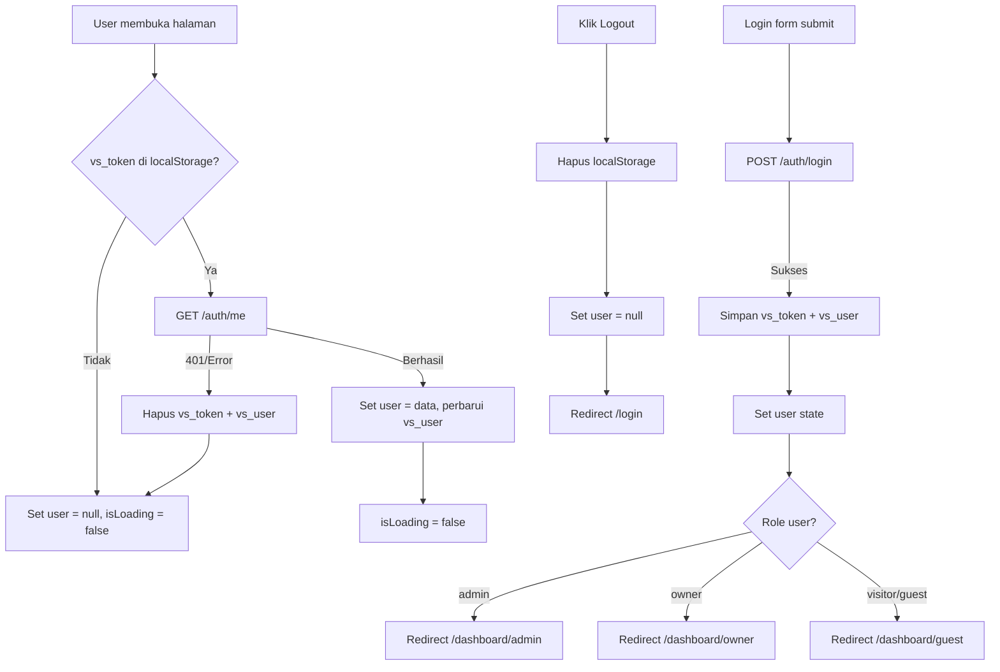
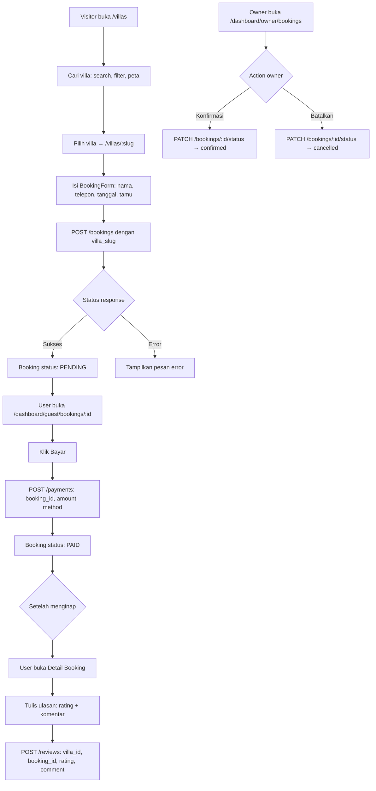
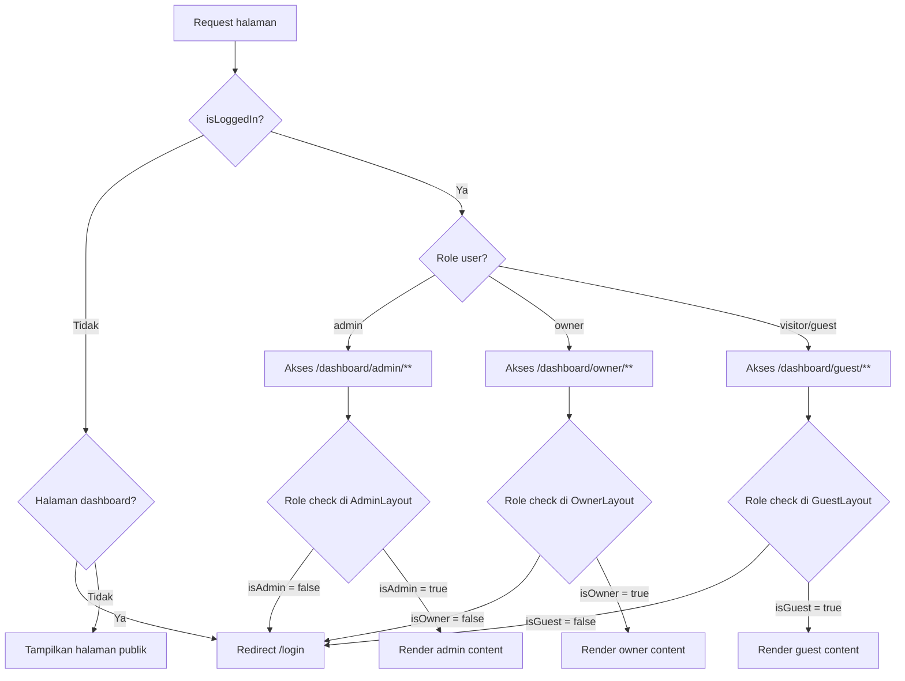
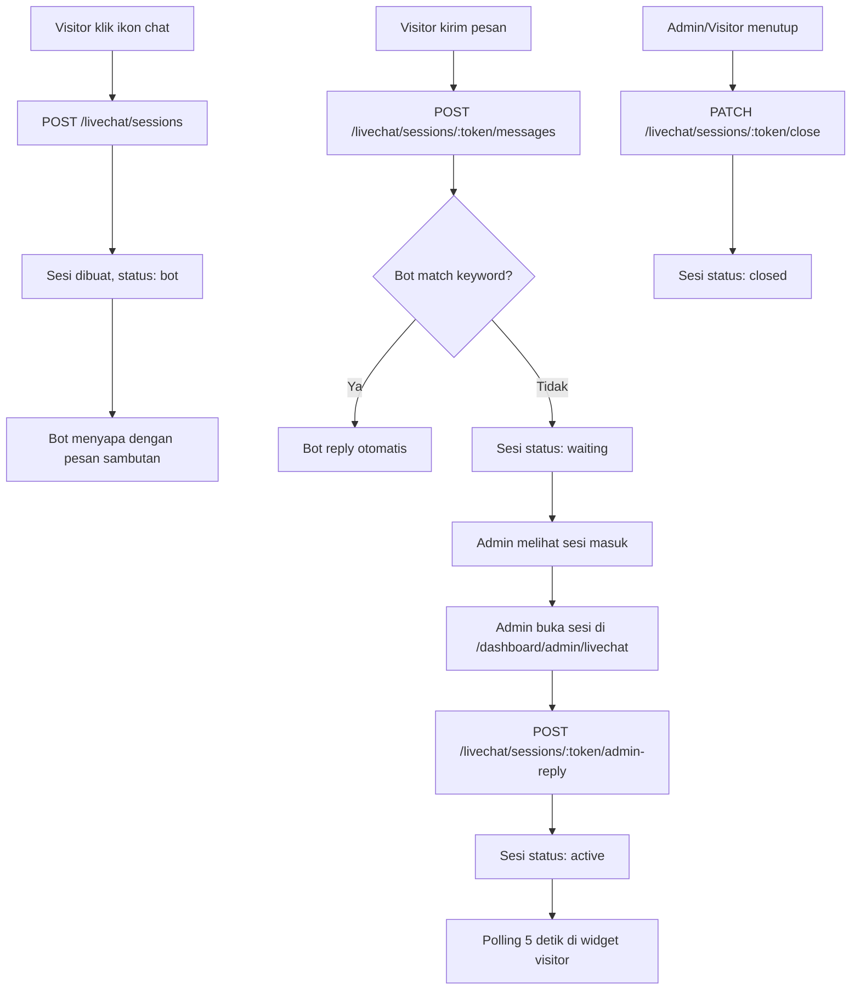
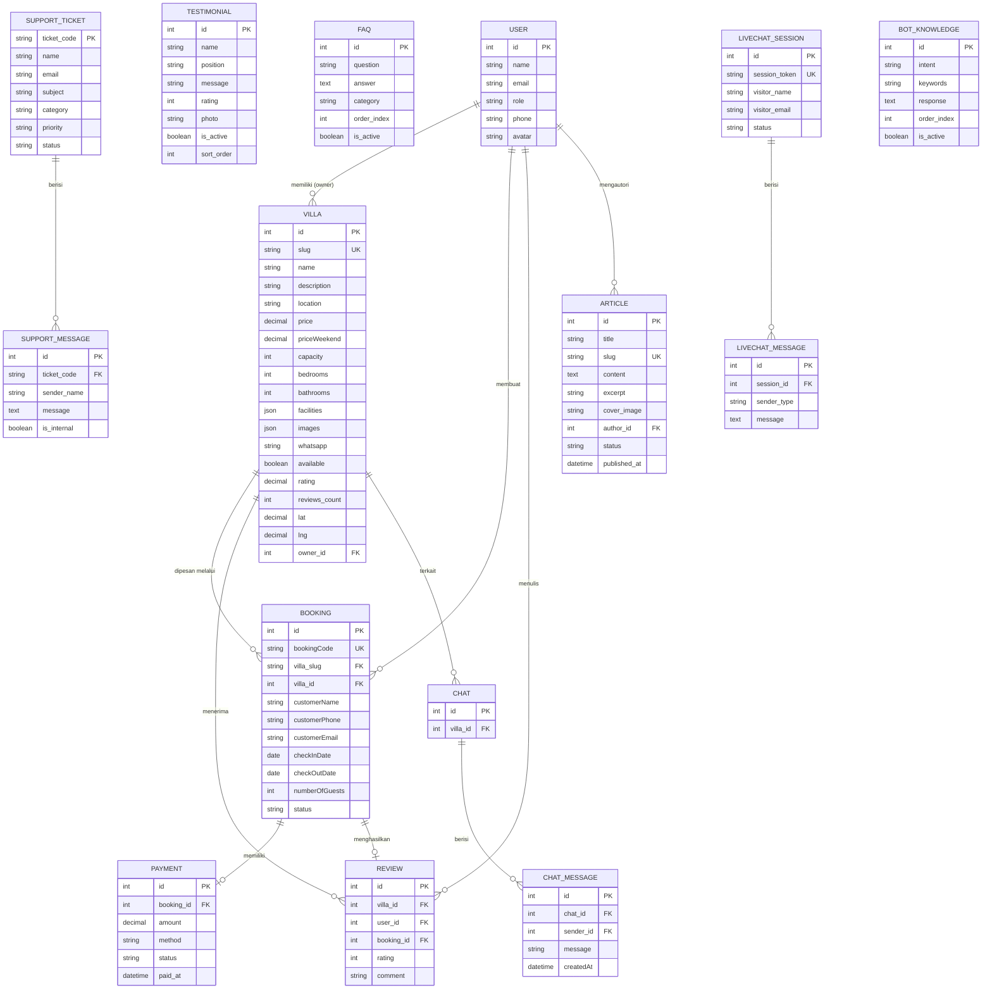

# Dokumentasi Teknis Frontend — Villa Sadulur

> Versi: 1.0 | Diperbarui: 2025 | Framework: Next.js 16 (App Router)

---

## Daftar Isi

1. [Gambaran Umum Proyek](#1-gambaran-umum-proyek)
2. [Tech Stack](#2-tech-stack)
3. [Setup Pengembangan](#3-setup-pengembangan)
4. [Variabel Environment](#4-variabel-environment)
5. [Struktur Proyek](#5-struktur-proyek)
6. [Semua Route Frontend](#6-semua-route-frontend)
7. [Modul & Halaman per Role](#7-modul--halaman-per-role)
8. [API Services](#8-api-services)
9. [Type System (TypeScript Interfaces)](#9-type-system-typescript-interfaces)
10. [State Management & Auth Context](#10-state-management--auth-context)
11. [Utility Functions](#11-utility-functions)
12. [Komponen Reusable](#12-komponen-reusable)
13. [Diagram Alur (Mermaid)](#13-diagram-alur-mermaid)
14. [ERD Data Model Frontend](#14-erd-data-model-frontend)
15. [Deployment](#15-deployment)

---

## 1. Gambaran Umum Proyek

**Villa Sadulur** adalah platform pemesanan villa online yang memiliki tiga level pengguna:

| Role | Deskripsi |
|------|-----------|
| `visitor` / `guest` | Pengunjung yang dapat mencari, memesan, dan mereview villa |
| `owner` | Pemilik villa yang mengelola properti dan menerima booking |
| `admin` | Super admin yang memiliki akses penuh ke semua fitur |

Fitur utama:
- Pencarian villa dengan filter lokasi (geo), harga, kapasitas, dan tanggal
- Tampilan peta interaktif menggunakan Leaflet + OpenStreetMap
- Sistem pemesanan online lengkap dengan manajemen status pembayaran
- Blog artikel, FAQ, dan halaman informasi publik
- Sistem support ticket dan live chat dengan bot otomatis
- Dashboard terpisah per role (Admin, Owner, Guest)

---

## 2. Tech Stack

| Kategori | Library | Versi |
|----------|---------|-------|
| Framework | Next.js | 16.2.1 |
| UI Runtime | React | 19.2.4 |
| Bahasa | TypeScript | 5.x (strict) |
| Styling | Tailwind CSS | v4 |
| HTTP Client | axios | 1.14.x |
| Data Fetching | @tanstack/react-query | v5 |
| Rich Text Editor | Tiptap | v3.22 |
| Peta | Leaflet + react-leaflet | 1.9.4 / v5 |
| Icons | lucide-react | 1.7.0 |
| State Management | zustand | v5.0.12 |
| Image Crop | react-image-crop | v11 |
| Font | Inter | Google Fonts |

### Warna Brand (Tailwind CSS v4)

```css
--color-primary:    #2C4B1A  /* Hijau tua */
--color-secondary:  #3A6928  /* Hijau sedang */
--color-accent:     #5C8A36  /* Hijau terang */
--color-light:      #A8D87A  /* Hijau muda */
```

---

## 3. Setup Pengembangan

### Prasyarat

- Node.js ≥ 18
- npm / yarn / pnpm
- Backend API berjalan di `http://be-sadulur.local/api`

### Instalasi

```bash
git clone <repo-url>
cd fe-sadulur
npm install
```

### Menjalankan Development Server

```bash
npm run dev
# Server berjalan di http://localhost:3000
```

### Build Produksi

```bash
npm run build
npm run start
# atau menggunakan PM2 (lihat §15)
```

### Konfigurasi Next.js (`next.config.ts`)

```ts
// Image remote patterns yang diizinkan:
images: {
  remotePatterns: [
    { hostname: 'villa-sadulur.my.id', pathname: '/uploads/**' },
    { hostname: 'be-sadulur.local',    pathname: '/uploads/**' },
  ]
}
```

---

## 4. Variabel Environment

Buat file `.env.local` di root proyek:

```env
# URL API backend (wajib)
NEXT_PUBLIC_API_URL=https://villa-sadulur.my.id/api

# Development (lokal)
# NEXT_PUBLIC_API_URL=http://be-sadulur.local/api
```

> Prefix `NEXT_PUBLIC_` wajib agar tersedia di browser (client-side).

### LocalStorage Keys

| Key | Isi |
|-----|-----|
| `vs_token` | JWT Bearer token |
| `vs_user` | JSON string objek `User` |

---

## 5. Struktur Proyek

```
fe-sadulur/
├── public/
│   └── images/
│       └── villa-placeholder.jpg
├── src/
│   ├── app/                          # Next.js App Router pages
│   │   ├── layout.tsx                # Root layout (Navbar + Footer + LiveChat)
│   │   ├── providers.tsx             # QueryClient + AuthProvider wrapper
│   │   ├── page.tsx                  # Homepage
│   │   ├── about/
│   │   ├── contact/
│   │   ├── login/
│   │   ├── register/
│   │   ├── forgot-password/
│   │   ├── reset-password/
│   │   ├── faq/
│   │   ├── support/
│   │   │   └── [ticketCode]/
│   │   ├── blog/
│   │   │   └── [slug]/
│   │   ├── villas/
│   │   │   └── [slug]/
│   │   └── dashboard/
│   │       ├── admin/
│   │       │   ├── layout.tsx
│   │       │   ├── page.tsx
│   │       │   ├── villas/
│   │       │   ├── bookings/
│   │       │   ├── payments/
│   │       │   ├── users/
│   │       │   ├── reports/
│   │       │   ├── reviews/
│   │       │   ├── testimonials/
│   │       │   ├── articles/
│   │       │   ├── faqs/
│   │       │   ├── support/
│   │       │   │   └── [ticketCode]/
│   │       │   └── livechat/
│   │       │       └── knowledge/
│   │       ├── owner/
│   │       │   ├── layout.tsx
│   │       │   ├── page.tsx
│   │       │   ├── villas/
│   │       │   │   └── add/
│   │       │   ├── bookings/
│   │       │   └── messages/
│   │       └── guest/
│   │           ├── layout.tsx
│   │           ├── page.tsx
│   │           ├── bookings/
│   │           │   └── [id]/
│   │           ├── messages/
│   │           ├── support/
│   │           └── profile/
│   ├── components/
│   │   ├── layout/
│   │   │   ├── Navbar.tsx
│   │   │   ├── Footer.tsx
│   │   │   └── DashboardShell.tsx
│   │   ├── booking/
│   │   │   └── BookingForm.tsx
│   │   ├── home/
│   │   │   ├── ArticlesSection.tsx
│   │   │   └── TestimonialsSection.tsx
│   │   ├── livechat/
│   │   │   ├── LiveChatWidget.tsx
│   │   │   └── LiveChatWidgetWrapper.tsx
│   │   ├── ui/
│   │   │   ├── ImageUploader.tsx
│   │   │   ├── LocationPicker.tsx
│   │   │   └── RichTextEditor.tsx
│   │   └── villa/
│   │       ├── ImageLightbox.tsx
│   │       ├── SearchBar.tsx
│   │       ├── VillaCard.tsx
│   │       ├── VillaListSection.tsx
│   │       └── VillaMapView.tsx
│   ├── contexts/
│   │   └── AuthContext.tsx
│   ├── lib/
│   │   └── apiClient.ts              # Axios instance + interceptors
│   ├── services/
│   │   ├── articleService.ts
│   │   ├── authService.ts
│   │   ├── bookingService.ts
│   │   ├── chatService.ts
│   │   ├── faqService.ts
│   │   ├── livechatService.ts
│   │   ├── paymentService.ts
│   │   ├── reviewService.ts
│   │   ├── supportService.ts
│   │   ├── testimonialService.ts
│   │   ├── userService.ts
│   │   └── villaService.ts
│   ├── types/
│   │   └── index.ts                  # Semua TypeScript interfaces
│   └── utils/
│       └── index.ts                  # Helper functions
├── next.config.ts
├── tsconfig.json
├── tailwind.config.ts
└── package.json
```

---

## 6. Semua Route Frontend

### 6.1 Halaman Publik

| Path | Deskripsi | Auth |
|------|-----------|------|
| `/` | Homepage (hero, villa unggulan, testimoni, artikel) | ❌ |
| `/about` | Tentang Kami | ❌ |
| `/contact` | Kontak | ❌ |
| `/login` | Form login | ❌ |
| `/register` | Form registrasi | ❌ |
| `/forgot-password` | Form kirim email reset password | ❌ |
| `/reset-password?token=...` | Form set password baru | ❌ |
| `/villas` | Daftar villa + peta + filter | ❌ |
| `/villas/[slug]` | Detail villa + form booking + ulasan | ❌ |
| `/blog` | Daftar artikel yang dipublikasikan | ❌ |
| `/blog/[slug]` | Detail artikel | ❌ |
| `/faq` | Halaman FAQ publik | ❌ |
| `/support` | Submit tiket support + cek status tiket | ❌ |
| `/support/[ticketCode]` | Thread tiket support publik | ❌ |

### 6.2 Dashboard Admin

> Semua route admin memerlukan `role = 'admin'`

| Path | Deskripsi |
|------|-----------|
| `/dashboard/admin` | Statistik ringkasan |
| `/dashboard/admin/villas` | CRUD semua villa |
| `/dashboard/admin/bookings` | Manajemen semua booking |
| `/dashboard/admin/payments` | Verifikasi pembayaran |
| `/dashboard/admin/users` | Manajemen pengguna |
| `/dashboard/admin/reports` | Laporan & analitik |
| `/dashboard/admin/reviews` | Moderasi ulasan villa |
| `/dashboard/admin/testimonials` | CRUD testimoni homepage |
| `/dashboard/admin/articles` | CRUD artikel blog (Tiptap editor) |
| `/dashboard/admin/faqs` | CRUD FAQ + pengurutan + toggle aktif |
| `/dashboard/admin/support` | Daftar tiket support (tabs per status) |
| `/dashboard/admin/support/[ticketCode]` | Thread tiket + balas + catatan internal |
| `/dashboard/admin/livechat` | Panel live chat admin (polling 5 detik) |
| `/dashboard/admin/livechat/knowledge` | CRUD bot knowledge base + test bot |

### 6.3 Dashboard Owner

> Memerlukan `role = 'owner'`

| Path | Deskripsi |
|------|-----------|
| `/dashboard/owner` | Statistik villa owner |
| `/dashboard/owner/villas` | CRUD villa milik owner |
| `/dashboard/owner/villas/add` | Form tambah villa baru |
| `/dashboard/owner/bookings` | Booking yang masuk ke villa owner |
| `/dashboard/owner/messages` | Chat dengan tamu |

### 6.4 Dashboard Guest

> Memerlukan `role = 'visitor'` atau `'guest'`

| Path | Deskripsi |
|------|-----------|
| `/dashboard/guest` | Statistik + booking terbaru |
| `/dashboard/guest/bookings` | Daftar booking (tabs per status) |
| `/dashboard/guest/bookings/[id]` | Detail booking + tombol bayar + tulis ulasan |
| `/dashboard/guest/messages` | Chat dengan owner villa |
| `/dashboard/guest/support` | My support tickets |
| `/dashboard/guest/profile` | Edit profil (nama, telepon) |

---

## 7. Modul & Halaman per Role

### 7.1 Modul Admin (13 halaman)

**Navigasi sidebar admin:**

```
Dashboard  →  /dashboard/admin
Villa      →  /dashboard/admin/villas
Booking    →  /dashboard/admin/bookings
Pembayaran →  /dashboard/admin/payments
Pengguna   →  /dashboard/admin/users
Laporan    →  /dashboard/admin/reports
Ulasan     →  /dashboard/admin/reviews
Testimoni  →  /dashboard/admin/testimonials
Artikel    →  /dashboard/admin/articles
FAQ        →  /dashboard/admin/faqs
Support    →  /dashboard/admin/support
LiveChat   →  /dashboard/admin/livechat
Bot KB     →  /dashboard/admin/livechat/knowledge
```

**Fitur per halaman:**

| Halaman | Fitur Utama |
|---------|-------------|
| Dashboard | Jumlah villa, booking aktif, pendapatan bulan ini, pengguna baru |
| Villa | Tabel villa dengan search; tombol tambah/edit/hapus; form lengkap dengan photo upload, peta, fasilitas |
| Booking | Filter status (pending/confirmed/paid/cancelled); ubah status; hapus booking |
| Pembayaran | Verifikasi pembayaran manual; lihat bukti transfer |
| Pengguna | CRUD pengguna; reset password; filter role |
| Laporan | Grafik pendapatan bulanan; statistik per villa |
| Ulasan | Tabel semua ulasan; detail reviewer; hapus ulasan bermasalah |
| Testimoni | CRUD testimoni homepage; toggle aktif/nonaktif; upload foto |
| Artikel | CRUD artikel; Tiptap rich text editor; toggle published/draft; upload cover |
| FAQ | CRUD FAQ; drag-reorder urutan; toggle aktif; filter kategori |
| Support | Tabs: open/in_progress/resolved/closed; detail tiket; tambah catatan internal |
| LiveChat | Daftar sesi aktif (polling 5 detik); balas pesan visitor |
| Bot KB | CRUD intent + keywords + response; uji bot dengan input manual |

### 7.2 Modul Owner (4 halaman)

**Navigasi sidebar owner:**

```
Beranda    →  /dashboard/owner
Villa Saya →  /dashboard/owner/villas
Booking    →  /dashboard/owner/bookings
Pesan      →  /dashboard/owner/messages
```

**Fitur:**

| Halaman | Fitur Utama |
|---------|-------------|
| Dashboard | Statistik villa owner, pendapatan, booking aktif |
| Villa Saya | CRUD villa milik owner; manajemen foto; setting kalender ketersediaan |
| Booking | Daftar booking masuk; konfirmasi / batalkan booking |
| Pesan | Thread chat dengan masing-masing tamu |

### 7.3 Modul Guest (6 halaman)

**Navigasi sidebar guest:**

```
Beranda    →  /dashboard/guest
Cari Villa →  /villas
Booking Saya →  /dashboard/guest/bookings
Pesan      →  /dashboard/guest/messages
Dukungan   →  /dashboard/guest/support
Profil     →  /dashboard/guest/profile
```

**Fitur:**

| Halaman | Fitur Utama |
|---------|-------------|
| Dashboard | Ringkasan booking aktif + riwayat singkat |
| Booking Saya | Filter per status; klik detail; tombol bayar; tulis ulasan |
| Detail Booking | Info lengkap booking + status pembayaran + form review |
| Pesan | Chat dengan owner villa yang dipesan |
| Dukungan | Daftar tiket saya; buat tiket baru; lacak status tiket |
| Profil | Edit nama dan nomor telepon |

### 7.4 Halaman Publik

| Halaman | Fitur Utama |
|---------|-------------|
| Homepage (`/`) | Hero section, villa unggulan (react-query), testimoni dinamis, artikel terbaru |
| Villas (`/villas`) | SearchBar, toggle peta/grid, VillaMapView (Leaflet), VillaListSection, filter budget |
| Detail Villa (`/villas/[slug]`) | Galeri foto (lightbox), informasi villa, lokasi peta, form booking, kalkulasi malam, ulasan |
| Blog (`/blog`) | Daftar artikel status=published, pagination |
| Detail Artikel (`/blog/[slug]`) | Render konten HTML dari Tiptap (dangerouslySetInnerHTML) |
| FAQ (`/faq`) | Accordion grouped by category |
| Support (`/support`) | Form submit tiket + form cek status tiket via kode |
| Thread Tiket (`/support/[ticketCode]`) | Riwayat pesan tiket; form balas sebagai pengunjung |

---

## 8. API Services

Base URL dikonfigurasi melalui `NEXT_PUBLIC_API_URL`. Semua request sudah otomatis dilengkapi header `Authorization: Bearer <token>` melalui axios interceptor.

### 8.1 `authService`

| Method | Endpoint | Deskripsi |
|--------|----------|-----------|
| `login(email, password)` | `POST /auth/login` | Login; response: `{ token, user }` |
| `register(payload)` | `POST /auth/register` | Registrasi; response: `{ token, user }` |
| `getMe()` | `GET /auth/me` | Ambil profil pengguna dari token |
| `updateProfile(payload)` | `PUT /auth/profile` | Update nama/telepon/password |
| `forgotPassword(email)` | `POST /auth/forgot-password` | Kirim email reset password |
| `verifyResetToken(token)` | `GET /auth/verify-reset-token/:token` | Validasi token reset |
| `resetPassword(token, new_password)` | `POST /auth/reset-password` | Set password baru |

### 8.2 `villaService`

| Method | Endpoint | Deskripsi |
|--------|----------|-----------|
| `getAll(filters)` | `GET /villas` | Daftar villa; filter: search, minPrice, maxPrice, capacity, lat, lng, radius, page, limit |
| `getBySlug(slug)` | `GET /villas/:slug` | Detail villa |
| `create(payload)` | `POST /villas` | Buat villa (multipart/form-data) |
| `update(slug, payload)` | `PUT /villas/:slug` | Edit villa (multipart/form-data) |
| `delete(slug)` | `DELETE /villas/:slug` | Hapus villa |
| `getCalendar(slug)` | `GET /villas/:slug/calendar` | Ambil entri kalender ketersediaan |
| `updateCalendar(slug, entries)` | `POST /villas/:slug/calendar` | Simpan entri kalender |

> **Catatan:** Frontend memetakan `min_price`/`max_price` → `minPrice`/`maxPrice` sebelum dikirim ke backend.

### 8.3 `bookingService`

| Method | Endpoint | Deskripsi |
|--------|----------|-----------|
| `create(payload)` | `POST /bookings` | Buat booking; `villa_slug` wajib |
| `getMyBookings(params)` | `GET /bookings` | Booking milik user login; filter: status, page, limit |
| `getAllBookings(params)` | `GET /bookings/all` | Semua booking (admin) |
| `getById(id)` | `GET /bookings/:id` | Detail booking |
| `updateStatus(id, status)` | `PATCH /bookings/:id/status` | Ubah status booking |
| `delete(id)` | `DELETE /bookings/:id` | Hapus booking |

**Payload `create`:**
```ts
{
  villa_slug: string,
  customerName: string,
  customerPhone: string,
  customerEmail?: string,
  checkInDate: string,      // "YYYY-MM-DD"
  checkOutDate: string,     // "YYYY-MM-DD"
  numberOfGuests?: number
}
```

### 8.4 `paymentService`

| Method | Endpoint | Deskripsi |
|--------|----------|-----------|
| `create(payload)` | `POST /payments` | Buat pembayaran; `{ booking_id, amount, method? }` |
| `getById(id)` | `GET /payments/:id` | Detail pembayaran |
| `getByBookingId(bookingId)` | `GET /payments/booking/:bookingId` | Status pembayaran suatu booking |

### 8.5 `reviewService`

| Method | Endpoint | Deskripsi |
|--------|----------|-----------|
| `getAll(params)` | `GET /reviews` | Semua review (admin); filter: villa_id, user_id, rating, page, limit |
| `getById(id)` | `GET /reviews/:id` | Detail review (admin) |
| `create(payload)` | `POST /reviews` | Tulis review; `{ villa_id, booking_id?, rating, comment }` |
| `getByVilla(villaId)` | `GET /reviews/villa/:villaId` | Review publik suatu villa |
| `delete(id)` | `DELETE /reviews/:id` | Hapus review (admin) |

### 8.6 `chatService`

| Method | Endpoint | Deskripsi |
|--------|----------|-----------|
| `getMyChats()` | `GET /chats` | Chat milik user login |
| `getById(id)` | `GET /chats/:id` | Detail chat + pesan |
| `sendMessage(payload)` | `POST /chats` | Kirim pesan; `{ receiver_id, message, villa_id?, booking_id? }` |

> **Penting:** Tidak ada field `chat_id`. Backend create-or-find berdasarkan pasangan `sender_id` + `receiver_id`.

### 8.7 `userService`

| Method | Endpoint | Deskripsi |
|--------|----------|-----------|
| `getAll(params)` | `GET /users` | Daftar user; filter: role, search, page, limit |
| `getById(id)` | `GET /users/:id` | Detail user |
| `create(payload)` | `POST /users` | Buat user + password |
| `update(id, payload)` | `PUT /users/:id` | Edit user |
| `resetPassword(id, pw)` | `PATCH /users/:id/password` | Reset password admin |
| `delete(id)` | `DELETE /users/:id` | Hapus user |

### 8.8 `testimonialService`

| Method | Endpoint | Deskripsi |
|--------|----------|-----------|
| `getAll(all?)` | `GET /testimonials` | `?all=true` untuk admin (semua); default: aktif saja |
| `getById(id)` | `GET /testimonials/:id` | Detail testimoni (admin) |
| `create(formData)` | `POST /testimonials` | Buat testimoni + foto (multipart) |
| `update(id, formData)` | `PUT /testimonials/:id` | Edit testimoni + foto (multipart) |
| `toggle(id)` | `PATCH /testimonials/:id/toggle` | Toggle `is_active` |
| `delete(id)` | `DELETE /testimonials/:id` | Hapus testimoni |

### 8.9 `articleService`

| Method | Endpoint | Deskripsi |
|--------|----------|-----------|
| `getAll(params)` | `GET /articles` | Daftar artikel; filter: status, search, page, limit |
| `getBySlug(slug)` | `GET /articles/:slug` | Detail artikel + content penuh |
| `create(formData)` | `POST /articles` | Buat artikel + cover (multipart) |
| `update(slug, formData)` | `PUT /articles/:slug` | Edit artikel + cover (multipart) |
| `togglePublish(slug, status)` | `PATCH /articles/:slug/publish` | Toggle published/draft |
| `delete(slug)` | `DELETE /articles/:slug` | Hapus artikel |

### 8.10 `faqService`

| Method | Endpoint | Deskripsi |
|--------|----------|-----------|
| `getAll(params)` | `GET /faqs` | `?all=true` admin lihat semua; `?category=X` filter |
| `getById(id)` | `GET /faqs/:id` | Detail FAQ (admin) |
| `create(payload)` | `POST /faqs` | Buat FAQ |
| `update(id, payload)` | `PUT /faqs/:id` | Edit FAQ |
| `toggle(id)` | `PATCH /faqs/:id/toggle` | Toggle `is_active` |
| `reorder(items)` | `PATCH /faqs/reorder` | Reorder: `[{ id, order_index }]` |
| `delete(id)` | `DELETE /faqs/:id` | Hapus FAQ |

### 8.11 `supportService`

| Method | Endpoint | Deskripsi |
|--------|----------|-----------|
| `getAll(params)` | `GET /support` | Semua tiket (admin) atau milik sendiri (visitor) |
| `getByCode(code)` | `GET /support/:ticketCode` | Detail tiket + pesan-pesan |
| `create(payload)` | `POST /support` | Buat tiket baru (publik); response: `{ ticket_code }` |
| `reply(code, payload)` | `POST /support/:ticketCode/reply` | Balas tiket; `{ message, is_internal? }` |
| `update(code, payload)` | `PATCH /support/:ticketCode` | Update status/priority/assigned_to (admin) |
| `delete(code)` | `DELETE /support/:ticketCode` | Hapus tiket (admin) |

### 8.12 `livechatService`

| Method | Endpoint | Deskripsi |
|--------|----------|-----------|
| `startSession(payload?)` | `POST /livechat/sessions` | Mulai sesi; response: `{ session_token, session_id, messages }` |
| `getSession(token)` | `GET /livechat/sessions/:token` | Ambil sesi + riwayat pesan |
| `sendMessage(token, message)` | `POST /livechat/sessions/:token/messages` | Kirim pesan visitor; response: `{ botReply?, sessionStatus }` |
| `adminReply(token, message)` | `POST /livechat/sessions/:token/admin-reply` | Balas dari admin |
| `closeSession(token)` | `PATCH /livechat/sessions/:token/close` | Tutup sesi |
| `getSessions(params?)` | `GET /livechat/sessions` | Daftar sesi (admin/owner) |
| `getKnowledge()` | `GET /livechat/knowledge` | Daftar bot knowledge (admin) |
| `createKnowledge(payload)` | `POST /livechat/knowledge` | Buat intent bot |
| `updateKnowledge(id, payload)` | `PUT /livechat/knowledge/:id` | Edit intent bot |
| `deleteKnowledge(id)` | `DELETE /livechat/knowledge/:id` | Hapus intent bot |
| `testBot(message)` | `POST /livechat/knowledge/test` | Uji respons bot |

---

## 9. Type System (TypeScript Interfaces)

File: `src/types/index.ts`

### Role

```ts
type Role = 'visitor' | 'guest' | 'owner' | 'admin'
```

### User

```ts
interface User {
  id: number
  name: string
  email: string
  role: Role
  phone?: string
  avatar?: string
  createdAt?: string
}
```

### Villa

```ts
interface Villa {
  id: number
  name: string
  description: string
  location: string
  price: number
  priceWeekend?: number
  capacity: number
  bedrooms?: number
  bathrooms?: number
  facilities: string[]
  images: string[]
  whatsapp?: string
  available: boolean
  rating?: number
  reviews_count?: number
  slug?: string
  lat?: number
  lng?: number
  latitude?: number    // alias, depends on backend
  longitude?: number   // alias, depends on backend
  owner_id?: number
  owner?: User
  createdAt?: string
  updatedAt?: string
}
```

### Booking

```ts
interface Booking {
  id: number
  bookingCode?: string
  villa_slug?: string
  villa_id?: number
  customerName: string
  customerPhone: string
  customerEmail?: string
  villaName?: string
  villaLocation?: string
  villaPrice?: number
  checkInDate?: string
  checkOutDate?: string
  numberOfGuests?: number
  status: 'pending' | 'confirmed' | 'cancelled' | 'paid'
  createdAt?: string
}
```

### Payment

```ts
interface Payment {
  id: number
  booking_id: number
  amount: number
  method?: string
  status: 'pending' | 'paid' | 'failed' | 'refunded'
  paid_at?: string
}
```

### Review

```ts
interface Review {
  id: number
  villa_id: number
  reviewer?: User
  rating: number
  comment: string
  createdAt?: string
}
```

### Chat & ChatMessage

```ts
interface ChatMessage {
  id: number
  chat_id: number
  sender_id: number
  message: string
  createdAt: string
}

interface Chat {
  id: number
  participants: User[]
  messages?: ChatMessage[]
  lastMessage?: ChatMessage
  villa_id?: number
}
```

### Testimonial

```ts
interface Testimonial {
  id: number
  name: string
  position?: string
  message: string
  rating: number
  photo?: string
  is_active: boolean
  sort_order: number
}
```

### Article

```ts
interface Article {
  id: number
  title: string
  slug: string
  content?: string
  excerpt?: string
  cover_image?: string
  author?: User
  status: 'published' | 'draft'
  published_at?: string
}
```

### Faq

```ts
interface Faq {
  id: number
  question: string
  answer: string
  category: string
  order_index: number
  is_active: boolean
}
```

### SupportTicket & SupportMessage

```ts
interface SupportMessage {
  id: number
  ticket_code: string
  sender_name: string
  message: string
  is_internal: boolean
  createdAt: string
}

interface SupportTicket {
  ticket_code: string
  name: string
  email: string
  subject: string
  category: string
  priority: 'low' | 'medium' | 'high'
  status: 'open' | 'in_progress' | 'resolved' | 'closed'
  messages?: SupportMessage[]
}
```

### LiveChat

```ts
interface LiveChatMessage {
  id: number
  session_id: number
  sender_type: 'visitor' | 'bot' | 'admin'
  message: string
  createdAt: string
}

interface LiveChatSession {
  id: number
  session_token: string
  visitor_name?: string
  visitor_email?: string
  status: 'bot' | 'waiting' | 'active' | 'closed'
  messages?: LiveChatMessage[]
}

interface BotKnowledge {
  id: number
  intent: string
  keywords: string     // comma-separated keywords
  response: string
  order_index: number
  is_active: boolean
}
```

### Generic API Response Wrappers

```ts
interface ApiResponse<T> {
  status: string
  message?: string
  data: T
}

interface PaginatedResponse<T> extends ApiResponse<T[]> {
  pagination?: {
    total: number
    page: number
    limit: number
    totalPages: number
  }
}

interface RegisterPayload {
  name: string
  email: string
  password: string
  role?: Role
  phone?: string
}

interface VillaFilters {
  search?: string
  min_price?: number
  max_price?: number
  capacity?: number
  lat?: number
  lng?: number
  radius?: number    // dalam kilometer (Haversine)
}
```

---

## 10. State Management & Auth Context

### AuthContext (`src/contexts/AuthContext.tsx`)

**State yang dikelola:**

| State | Type | Deskripsi |
|-------|------|-----------|
| `user` | `User \| null` | Data pengguna yang sedang login |
| `isLoading` | `boolean` | `true` selama verifikasi token awal |

**Computed values (tersedia via `useAuth()`):**

| Property | Kondisi |
|----------|---------|
| `isLoggedIn` | `!!user` |
| `isGuest` | `role === 'visitor' \|\| role === 'guest'` |
| `isOwner` | `role === 'owner'` |
| `isAdmin` | `role === 'admin'` |

**Actions:**

| Action | Behavior |
|--------|---------|
| `login(email, pw)` | POST `/auth/login` → simpan token + user ke localStorage, set state |
| `register(payload)` | POST `/auth/register` → simpan token + user, set state |
| `logout()` | Hapus `vs_token` + `vs_user` dari localStorage, reset state |
| `updateProfile(payload)` | PUT `/auth/profile` → update state + localStorage |

**Session restore (on mount):**
1. Cek apakah `vs_token` ada di localStorage
2. `GET /auth/me` untuk memvalidasi token
3. Jika valid → set `user` state + perbarui `vs_user` di storage
4. Jika 401/Error → hapus token, set `user = null`

### React Query (`src/app/providers.tsx`)

```ts
new QueryClient({
  defaultOptions: {
    queries: {
      staleTime: 5 * 60 * 1000,   // 5 menit
      retry: 1,
    }
  }
})
```

### Route Protection

Setiap dashboard layout melakukan pengecekan di `useEffect`:

```ts
// Contoh: AdminLayout
useEffect(() => {
  if (!isLoggedIn) router.push('/login')
  else if (!isAdmin) router.push('/login')
}, [isLoggedIn, isAdmin, router])
```

---

## 11. Utility Functions

File: `src/utils/index.ts`

| Fungsi | Signature | Deskripsi |
|--------|-----------|-----------|
| `getImageUrl` | `(path: string) => string` | Prepend `API_BASE` untuk path relatif; kembalikan placeholder jika kosong |
| `formatCurrency` | `(amount: number) => string` | Format IDR, contoh: `Rp 500.000` |
| `formatDate` | `(dateStr: string) => string` | Format tanggal Indonesia, contoh: `15 Januari 2025` |
| `calculateNights` | `(checkIn: string, checkOut: string) => number` | Hitung selisih malam antar dua tanggal |
| `getVillaThumbnail` | `(villa: Villa) => string` | Ambil gambar pertama villa atau placeholder |
| `slugify` | `(str: string) => string` | String → lowercase kebab-case |

---

## 12. Komponen Reusable

### Layout Components

#### `Navbar` (`src/components/layout/Navbar.tsx`)
- Mega-menu dengan dropdown:
  - **Jelajahi ▾**: Blog, Tentang Kami, Kontak
  - **Bantuan ▾**: FAQ, Dukungan
- Mendeteksi status login dan menampilkan link Dashboard atau Login/Daftar
- Responsive (hamburger menu untuk mobile)

#### `Footer` (`src/components/layout/Footer.tsx`)
- Link navigasi footer + informasi kontak

#### `DashboardShell` (`src/components/layout/DashboardShell.tsx`)
- Sidebar yang dipakai bersama oleh Admin, Owner, dan Guest
- Props:

```ts
interface DashboardNavItem {
  href: string
  icon: LucideIcon
  label: string
  exact?: boolean    // true = hanya aktif di exact path
}

interface DashboardShellProps {
  navItems: DashboardNavItem[]
  headerLabel: string
  headerBg: string            // CSS gradient string
  headerIcon: LucideIcon
  userName: string
  userEmail: string
  onLogout: () => void
  children: React.ReactNode
}
```

### Villa Components

#### `VillaCard` (`src/components/villa/VillaCard.tsx`)
- Kartu villa dengan gambar thumbnail, nama, lokasi, harga, dan rating
- Link ke `/villas/${villa.slug ?? villa.id}`

#### `VillaListSection` (`src/components/villa/VillaListSection.tsx`)
- Grid `VillaCard` menggunakan react-query
- Menangani loading skeleton dan empty state

#### `VillaMapView` (`src/components/villa/VillaMapView.tsx`)
- Leaflet map dengan marker harga villa
- Mendukung geo search (klik peta → kirim `lat, lng, radius` ke API)
- Di-import dinamis (`{ ssr: false }`) untuk menghindari SSR error

#### `SearchBar` (`src/components/villa/SearchBar.tsx`)
- Form pencarian: teks, tanggal check-in/out, kapasitas tamu

#### `ImageLightbox` (`src/components/villa/ImageLightbox.tsx`)
- Galeri foto fullscreen dengan navigasi next/prev

### Booking

#### `BookingForm` (`src/components/booking/BookingForm.tsx`)
- Form pemesanan yang ada di halaman detail villa
- Payload: `{ villa_slug, customerName, customerPhone, checkInDate, checkOutDate, numberOfGuests }`
- Kalkulasi otomatis harga × jumlah malam

### Home Sections

#### `TestimonialsSection` (`src/components/home/TestimonialsSection.tsx`)
- Client component; fetch `GET /testimonials` (hanya yang `is_active`)
- Carousel testimoni di homepage

#### `ArticlesSection` (`src/components/home/ArticlesSection.tsx`)
- Client component; fetch 3 artikel terbaru yang dipublikasikan
- Grid artikel di homepage

### UI Components

#### `RichTextEditor` (`src/components/ui/RichTextEditor.tsx`)
- Tiptap editor dengan toolbar lengkap
- Extension: `StarterKit`, `Link`, `TextAlign`, `Underline`, `Placeholder`
- Dipakai di form artikel admin

#### `LocationPicker` (`src/components/ui/LocationPicker.tsx`)
- Leaflet map + search via Nominatim (OpenStreetMap geocoder)
- Output: `{ lat, lng, address }`
- Di-import dinamis (`{ ssr: false }`)

#### `ImageUploader` (`src/components/ui/ImageUploader.tsx`)
- Drag-and-drop + crop menggunakan `react-image-crop`
- Support multiple images
- Output: `File[]` untuk dikirim ke API sebagai multipart

### LiveChat

#### `LiveChatWidgetWrapper` (`src/components/livechat/LiveChatWidgetWrapper.tsx`)
- Client-only wrapper agar `LiveChatWidget` tidak di-render di server

#### `LiveChatWidget` (`src/components/livechat/LiveChatWidget.tsx`)
- Floating chat button di semua halaman publik
- State machine: `idle → bot → waiting → active → closed`
- Polling untuk cek balasan admin

---

## 13. Diagram Alur (Mermaid)

### 13.1 Auth Flow



### 13.2 Booking Workflow



### 13.3 Routing per Role



### 13.4 LiveChat Flow



### 13.5 Support Ticket Flow

```mermaid
flowchart TD
    A[User buka /support] --> B[Isi form: nama, email, subjek, pesan]
    B --> C[POST /support]
    C --> D[Response: ticket_code]
    D --> E[User simpan ticket_code]

    E --> F[Cek status: GET /support/:ticketCode]
    F --> G[Lihat thread pesan]
    G --> H[POST /support/:ticketCode/reply]

    I[Admin buka /dashboard/admin/support] --> J[Filter tiket per status]
    J --> K[Klik tiket → /dashboard/admin/support/:ticketCode]
    K --> L{Admin action}
    L -- Balas --> M[POST /support/:ticketCode/reply]
    L -- Catatan internal --> N[POST reply dengan is_internal: true]
    L -- Update status --> O[PATCH /support/:ticketCode: { status }]
```

---

## 14. ERD Data Model Frontend

Diagram berikut menunjukkan relasi antar entitas yang dikelola di frontend.



---

## 15. Deployment

### Server

| Item | Nilai |
|------|-------|
| PM2 Process Name | `fe-vilasad` |
| Port | `3031` |
| Node Environment | `production` |

### Perintah Deployment

```bash
# Build
npm run build

# Start/restart dengan PM2
pm2 restart fe-vilasad
# atau
pm2 start npm --name "fe-vilasad" -- start -- -p 3031

# Cek logs
pm2 logs fe-vilasad

# Cek status
pm2 status
```

### Konfigurasi PM2 (`ecosystem.config.js`)

```js
module.exports = {
  apps: [{
    name: 'fe-vilasad',
    script: 'node_modules/.bin/next',
    args: 'start -p 3031',
    env: {
      NODE_ENV: 'production',
      NEXT_PUBLIC_API_URL: 'https://villa-sadulur.my.id/api',
    }
  }]
}
```

### URL Produksi

| Service | URL |
|---------|-----|
| Frontend | `https://villa-sadulur.my.id` |
| Backend API | `https://villa-sadulur.my.id/api` |

### Reverse Proxy (Nginx — contoh)

```nginx
location / {
    proxy_pass http://localhost:3031;
    proxy_http_version 1.1;
    proxy_set_header Upgrade $http_upgrade;
    proxy_set_header Connection 'upgrade';
    proxy_set_header Host $host;
    proxy_cache_bypass $http_upgrade;
}
```

---

## Lampiran: Catatan Teknis Penting

### SSR Safety untuk Leaflet

Leaflet tidak kompatibel dengan SSR (mengakses `window`). Solusi:

```ts
// Selalu gunakan dynamic import untuk komponen Leaflet
const VillaMapView = dynamic(() => import('@/components/villa/VillaMapView'), { ssr: false })
const LocationPicker = dynamic(() => import('@/components/ui/LocationPicker'), { ssr: false })

// Di dalam komponen Leaflet, tambahkan:
delete (L.Icon.Default.prototype as any)._getIconUrl
L.Icon.Default.mergeOptions({ iconUrl: '...', shadowUrl: '...' })
```

### Slug vs ID untuk Villa

Backend telah bermigrasi ke slug-based URLs. **Selalu gunakan `slug` bukan `id`** untuk:
- Halaman detail villa: `/villas/[slug]`
- Semua operasi CRUD: `villaService.getBySlug()`, `update(slug, ...)`, `delete(slug)`
- Payload booking: `{ villa_slug: string }`

### File Upload (Multipart)

Service yang menggunakan `multipart/form-data`:
- `villaService.create()` / `update()` — field `images` (multiple files)
- `articleService.create()` / `update()` — field `cover_image`
- `testimonialService.create()` / `update()` — field `photo`

Semua services secara otomatis mengatur header `Content-Type: multipart/form-data`.

### Parameter Price di API

Frontend menggunakan `min_price`/`max_price` (snake_case), tetapi backend mengharapkan `minPrice`/`maxPrice` (camelCase). Pemetaan dilakukan di `villaService.getAll()`:

```ts
const { min_price, max_price, ...rest } = filters ?? {}
if (min_price !== undefined) params.minPrice = min_price
if (max_price !== undefined) params.maxPrice = max_price
```

### Backend API Image URL

Untuk menampilkan gambar dari server, gunakan `getImageUrl()`:

```ts
// Path relatif seperti "/uploads/villas/img.jpg"
// → "https://villa-sadulur.my.id/uploads/villas/img.jpg"


// Atau dengan Next.js Image:
<Image src={getImageUrl(villa.images[0])} ... />
```

---

*Dokumentasi ini dibuat secara otomatis dari codebase `fe-sadulur`. Perbarui setiap kali ada penambahan fitur baru.*
